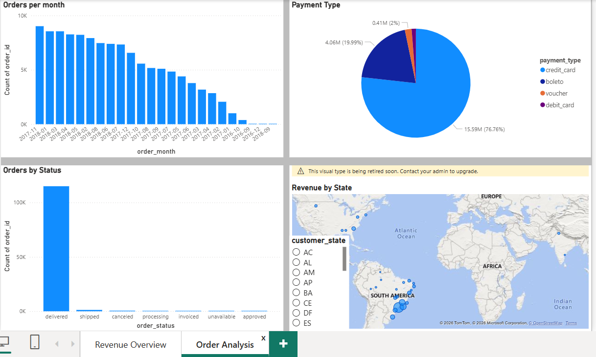
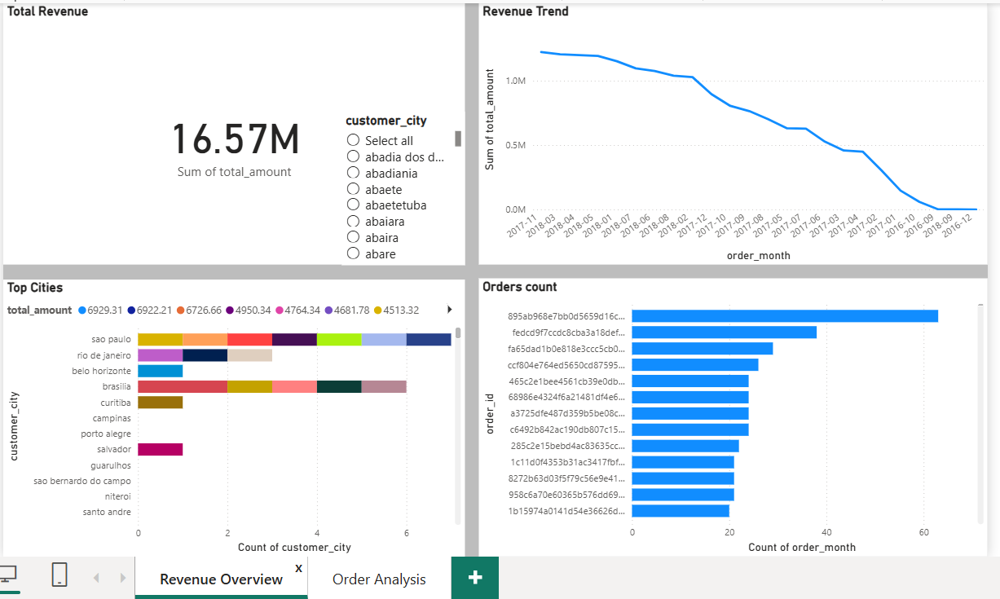

# E-commerce ETL Pipeline & Dashboard

# Overview
Built an end-to-end ETL pipeline using Python to process e-commerce data, loaded it into MySQL, and created an interactive Power BI dashboard for business insights.

# Tech Stack
- Python (Pandas, SQLAlchemy)
- MySQL
- Power BI
- ODBC

# ETL Process
- Extract: Loaded CSV data  
- Transform: Merged datasets, cleaned data, created features  
- Load: Stored data in MySQL (`ecommerce_orders` table)  

# Dashboard Highlights and Preview
- Revenue Trend  
- Orders by Status  
- Top Cities  
- Payment Distribution





or

Open the .pbix file in Power BI Desktop to explore the dashboard.

# Run the Project
```bash
pip install -r requirements.txt
python main.py
